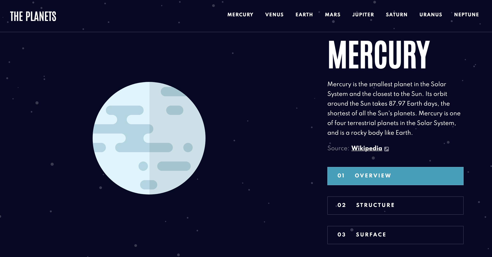

# Frontend Mentor - Planets fact site solution

This is a solution to the [Planets fact site challenge on Frontend Mentor](https://www.frontendmentor.io/challenges/planets-fact-site-gazqN8w_f). Frontend Mentor challenges help you improve your coding skills by building realistic projects. 

## Table of contents

- [Overview](#overview)
  - [The challenge](#the-challenge)
  - [Screenshot](#screenshot)
  - [Links](#links)
- [My process](#my-process)
  - [Built with](#built-with)
  - [What I learned](#what-i-learned)
  - [Continued development](#continued-development)

## Overview

### The challenge

Users should be able to:

- View the optimal layout for the app depending on their device's screen size
- See hover states for all interactive elements on the page
- View each planet page and toggle between "Overview", "Internal Structure", and "Surface Geology"

### Screenshot

### Links

- [Solution URL:](https://your-solution-url.com)
- [Live Site URL](https://naughty-mestorf-fbc929.netlify.app/)

## My process

### Built with

- CSS custom properties
- Flexbox
- [React](https://reactjs.org/) - JS library

### What I learned

This was one of the more extensive React projects I've undertaken. I decided on React for this project because of the ease of use for state. It was interesting that the most difficult part of the project for me was the styling. 

I think this project has really helped me build my React skills. 

### Continued development

I'd love to come back again to this in a few months or years and see how I can improve my code. 

